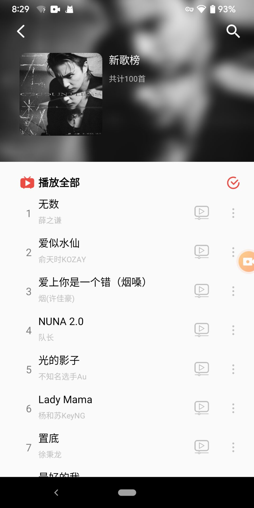
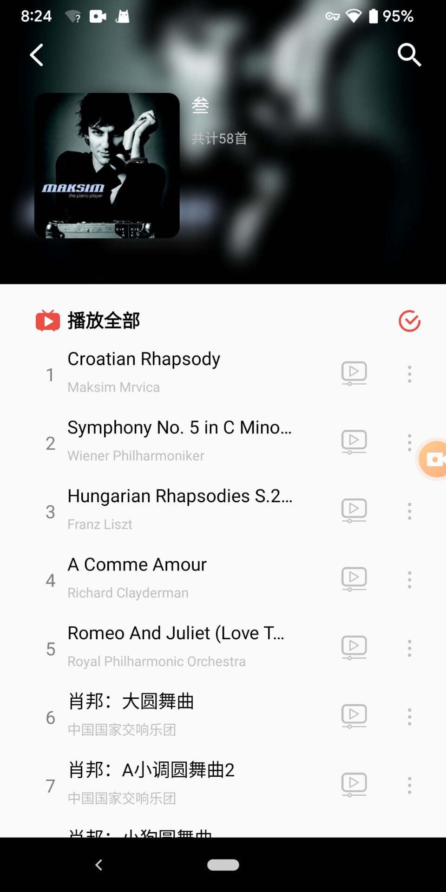
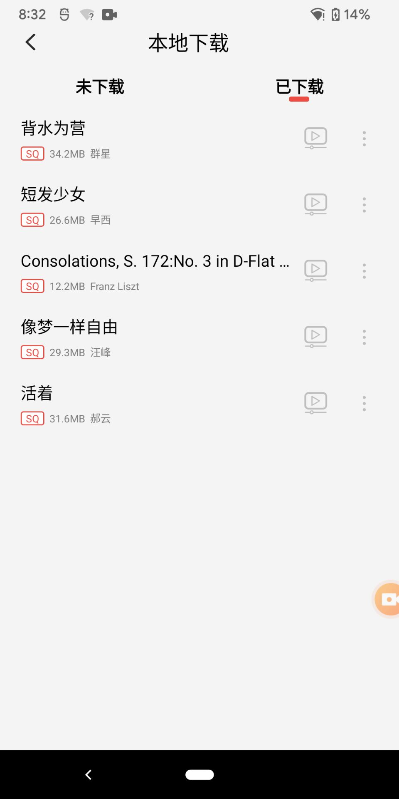
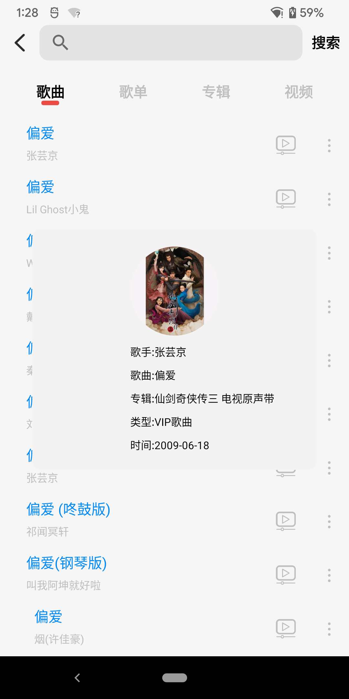
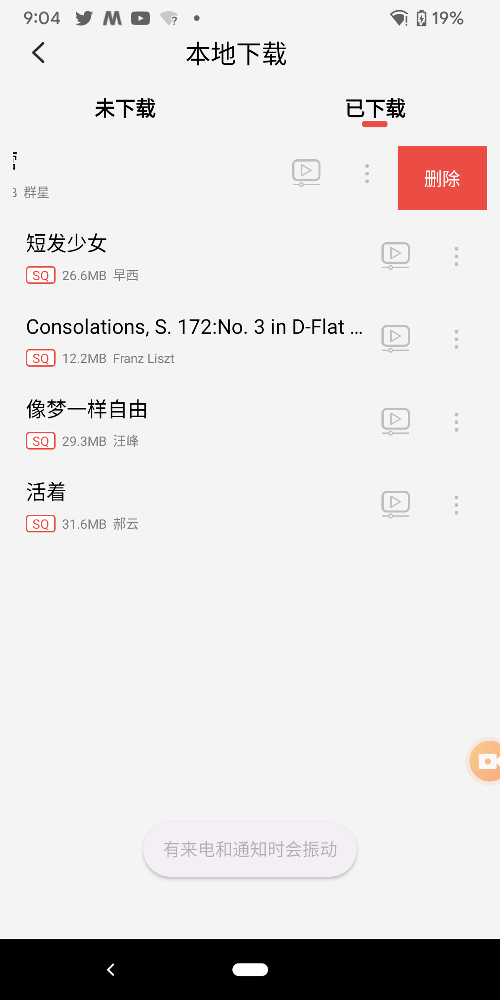

# EasyMusic
## 功能模块
EasyMusic APP基于网易云音乐接口实现如下功能:
- 音乐在线播放
- 音乐离线播放
- 音乐下载
- 歌词
- 专辑、歌单
- 模糊搜索
- MV、Mlog视频播放
- 音乐信息、个人信息
- 推荐音乐
- 音乐榜单
- and so on
## 开源库
- Glide
- Gson
- OkHttp
- EventBus
- GSYVideoPlayer
- FileDownloader
- [More ...](https://github.com/FranzLiszt-1847/EasyMusic/blob/main/app/build.gradle)

## 效果图
### 首页&播放页

### 最近播放页

### 播放列表

### 歌单&专辑页

### 搜索页

### 榜单页

### MV页

### mlog页

### 歌曲下载页

### 个人信息页

### 歌曲详情页

### 侧滑删除页

### 登录页

